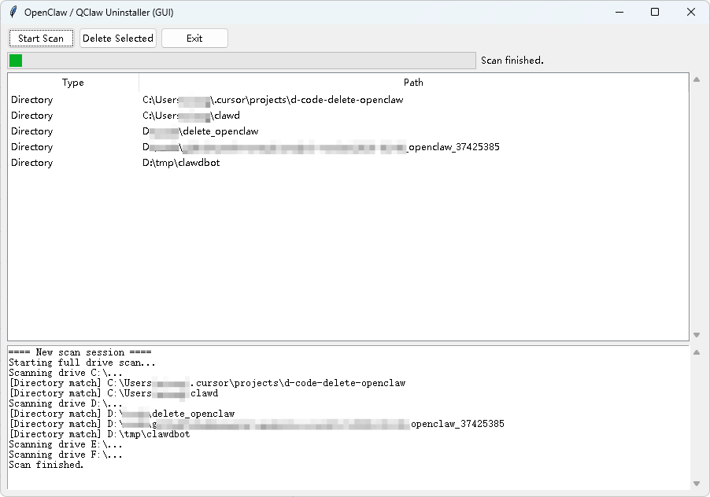

## OpenClaw / QClaw / Lobster-like App Uninstaller

[English](README_en.md) | [中文说明](README_zh-CN.md)



An open-source **Windows uninstaller for OpenClaw / QClaw / “lobster” style apps**, including:

- **CLI version**: `uninstall_openclaw.py`
- **GUI version**: `uninstall_openclaw_gui.py`

The GUI version is **bilingual (English / Chinese)**, shows **scan logs and progress**, and is more friendly for non-technical users.

---

### Features

- **Keyword-based detection** (case-insensitive) with default keywords:
  - `openclaw`, `qclaw`, `claw`, `小龙虾`
- **Full-drive scanning**:
  - Automatically scans all drives on the system (C:\\, D:\\, E:\\, ...).
  - Skips common system directories (`Windows`, `System Volume Information`, etc.) to reduce noise and improve performance.
- **Smart matching**:
  - Directory name contains a keyword → treated as a suspected install directory.
  - `.exe` file name contains a keyword → its parent directory is treated as a suspected install directory.
- **Safe & controlled deletion**:
  - Lists all suspected locations and lets the user **manually select** which ones to delete.
  - Shows a final confirmation dialog before deletion, clearly stating that the action is irreversible.
  - Clear error messages when deletion fails (e.g. due to insufficient permissions, suggesting to run as Administrator).
- **Bilingual support**:
  - CLI: simple language selection at startup (Chinese / English).
  - GUI: language selection dialog at startup (Yes = English / No = Chinese).

---

### Suggested Repository Layout

```text
delete_openclaw/
├─ uninstall_openclaw.py         # CLI version
├─ uninstall_openclaw_gui.py     # GUI version (tkinter)
├─ README_zh-CN.md               # Chinese README
├─ README_en.md                  # English README (this file)
└─ requirements.txt              # Development dependencies (e.g. PyInstaller)
```

> Note: `dist/`, `build/`, `*.spec`, `__pycache__/`, `*.pyc` and similar build artifacts or cache files **should not be committed** to GitHub (see below).

---

### What to Commit to GitHub

**Strongly recommended to commit:**

- `uninstall_openclaw.py`
- `uninstall_openclaw_gui.py`
- `README_zh-CN.md`
- `README_en.md`
- `requirements.txt` (if you expect others to build the executables or install dependencies easily)
- (Optional but recommended) `LICENSE` (MIT, GPL, Apache-2.0, or your preferred license)

**Should generally NOT be committed (add to `.gitignore`):**

- `dist/` (PyInstaller build output; contains the generated `.exe` files)
- `build/`
- `*.spec` (PyInstaller spec files)
- `__pycache__/`
- `*.pyc`
- Local virtual environments, e.g.:
  - `venv/`
  - `.venv/`

A simple `.gitignore` example:

```gitignore
dist/
build/
__pycache__/
*.pyc
*.pyo
*.pyd
*.spec
venv/
.venv/
```

---

### Requirements

- OS: **Windows 10 / 11**
- Python: **3.10+** recommended
- Dependencies:
  - For running the Python source (CLI/GUI): only standard library modules are used (`tkinter`, `os`, `shutil`, `threading`, etc.).
  - For building standalone executables: `PyInstaller` is required.

Install dependencies via:

```bash
pip install -r requirements.txt
```

Or install PyInstaller only:

```bash
pip install pyinstaller
```

---

### Usage: CLI Version

1. Open PowerShell (preferably **Run as administrator**).
2. Change to the project directory:

```powershell
cd d:\code\delete_openclaw
```

3. Run the script:

```powershell
python uninstall_openclaw.py
```

4. Select the language (Chinese / English) and confirm whether to start a full-drive scan.
5. After scanning completes, all suspected install directories/programs will be listed:
   - Enter indices like `1` or `1,3,5` to select specific items.
   - Enter `all` to delete everything in the list.
6. After the final confirmation, the script will recursively delete selected directories/files and print results to the console.

---

### Usage: GUI Version

1. Run the GUI script:

```powershell
python uninstall_openclaw_gui.py
```

2. A language selection dialog will appear:
   - **Yes** → English interface.
   - **No** → Chinese interface.

3. Main window:
   - Click **“Start Scan” / “开始扫描”**:
     - The log panel at the bottom shows real-time progress (which drive is being scanned, what matches are found, etc.).
     - The progress bar at the top indicates that scanning is in progress.
   - After the scan finishes, the table lists all suspected directories/programs:
     - Columns: **Type** (Directory / Executable) and **Path**.

4. Deletion:
   - Select one or more rows in the table (multi-select with Ctrl / Shift).
   - Click **“Delete Selected” / “删除所选”**.
   - Confirm in the popup dialog; the tool will then attempt to delete the selected paths and show results in the log.

> **Important:** It is strongly recommended to run the GUI executable as **Administrator** (right-click → “Run as administrator”) to avoid permission-related failures.

---

### Building Executables with PyInstaller

Example for the GUI version:

```powershell
cd d:\code\delete_openclaw

pyinstaller --onefile --noconsole --name uninstall_openclaw_gui uninstall_openclaw_gui.py
```

After a successful build:

- The executable will be located at: `dist\uninstall_openclaw_gui.exe`
- This is a **GUI-only** program (no console window).

Example for the CLI version:

```powershell
pyinstaller --onefile --name uninstall_openclaw uninstall_openclaw.py
```

The executable will be located at: `dist\uninstall_openclaw.exe`

---

### Warnings & Disclaimer

- This tool identifies **suspected** OpenClaw / QClaw / lobster-related applications purely by **keyword matching**, so **false positives are possible**.
- Deletion is a **physical removal of directories/files** and is **irreversible**. Double-check the paths before confirming deletion.
- The tool **does not remove Windows registry entries**; it only deletes files/directories on disk.
- By using this tool, you acknowledge and accept that you are responsible for any consequences resulting from its use.

---

### License

Please add your preferred open-source license (e.g. MIT / GPL / Apache-2.0) here and include a corresponding `LICENSE` file in the repository.

