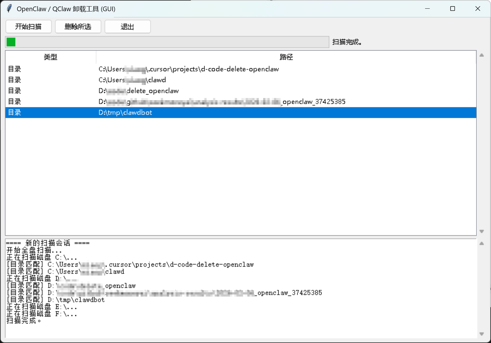

## OpenClaw / QClaw / 小龙虾 卸载工具

[English](README_en.md) | [中文说明](README_zh-CN.md)



一个用于在 Windows 上**扫描并卸载 OpenClaw / QClaw / 小龙虾 等相关应用**的开源工具，包含：

- **命令行版本**：`uninstall_openclaw.py`
- **图形界面版本（GUI）**：`uninstall_openclaw_gui.py`

图形界面版本支持**中英文双语**，带有**扫描日志与进度指示**，更适合普通用户使用。

---

### 功能特性

- **多关键字匹配**：默认搜索以下关键字（不区分大小写）：
  - `openclaw`, `qclaw`, `claw`, `小龙虾`
- **全盘扫描**：
  - 自动遍历当前系统所有盘符（C:\\, D:\\, E:\\ ...）。
  - 跳过常见系统目录（`Windows`, `System Volume Information` 等），减少误删和提升速度。
- **智能匹配**：
  - 目录名匹配关键字 → 视为疑似安装目录。
  - `.exe` 可执行文件名匹配关键字 → 其所在目录视为疑似安装目录。
- **安全可控删除**：
  - 列出所有疑似安装路径，由用户**手动选择**要删除的项目。
  - 删除前再次弹窗确认，强调“操作不可恢复”。
  - 删除失败时给出清晰错误提示（例如权限不足，建议用管理员权限运行）。
- **双语支持**：
  - 控制台版本：启动时支持简单语言选择（中文 / English）。
  - GUI 版本：启动时弹出语言选择对话框（Yes=English / No=中文）。

---

### 目录结构（建议）

```text
delete_openclaw/
├─ uninstall_openclaw.py         # 命令行版本
├─ uninstall_openclaw_gui.py     # 图形界面版本（tkinter）
├─ README_zh-CN.md               # 中文说明（本文件）
├─ README_en.md                  # English README
└─ requirements.txt              # 开发依赖（例如 PyInstaller）
```

> 说明：`dist/`、`build/`、`*.spec`、`__pycache__/`、`.pyc` 等属于构建产物或缓存文件，**不建议提交到 GitHub**，下面会说明。

---

### 需要提交到 GitHub 的文件建议

**强烈建议提交：**

- `uninstall_openclaw.py`  
- `uninstall_openclaw_gui.py`  
- `README_zh-CN.md`  
- `README_en.md`  
- `requirements.txt`（如果你计划让其他人也打包 exe 或安装依赖）  
- （可选但推荐）`LICENSE`（例如 MIT、GPL 等开源协议）

**不建议提交（应写入 `.gitignore`）：**

- `dist/` 目录（PyInstaller 生成的 exe 产物）
- `build/` 目录
- `*.spec`（PyInstaller 的构建配置文件）
- `__pycache__/` 目录
- `*.pyc` 等编译缓存
- 本地虚拟环境目录，例如：
  - `venv/`
  - `.venv/`

一个简单的 `.gitignore` 示例（可按需添加到仓库根目录）：

```gitignore
dist/
build/
__pycache__/
*.pyc
*.pyo
*.pyd
*.spec
venv/
.venv/
```

---

### 运行环境要求

- 操作系统：**Windows 10 / 11**
- Python：建议 **3.10+**
- 依赖：
  - 运行 Python 源码（命令行/GUI）：仅使用标准库（`tkinter`, `os`, `shutil`, `threading` 等）。
  - 如果希望自行打包 exe：需要安装 `PyInstaller`。

安装依赖（典型示例）：

```bash
pip install -r requirements.txt
```

或只安装 PyInstaller：

```bash
pip install pyinstaller
```

---

### 使用方法：命令行版本

1. 打开 PowerShell（建议“以管理员身份运行”）。
2. 进入项目目录：

```powershell
cd d:\code\delete_openclaw
```

3. 运行脚本：

```powershell
python uninstall_openclaw.py
```

4. 按提示选择语言（中文 / English），确认是否开始全盘扫描。
5. 扫描结束后，会列出所有疑似安装目录/程序：
   - 通过输入序号（例如 `1` 或 `1,3,5`）选择要删除的项目。
   - 或输入 `all` 删除所有列出的项目。
6. 确认删除后，脚本会递归删除所选目录/文件，并在终端中输出结果。

---

### 使用方法：图形界面版本（GUI）

1. 双击或通过命令行运行：

```powershell
python uninstall_openclaw_gui.py
```

2. 弹出语言选择对话框：
   - 选择 **Yes** 使用英文界面。
   - 选择 **No** 使用中文界面。

3. 主界面：
   - 点击 **“开始扫描 / Start Scan”**：
     - 下方日志窗口会持续输出当前扫描进度（正在扫描哪个盘、匹配到哪些目录/可执行文件）。
     - 上方进度条滚动显示扫描中状态。
   - 扫描完成后，表格中会列出所有疑似安装目录/程序。

4. 删除：
   - 在表格中选中一行或多行（支持 Ctrl / Shift 多选）。
   - 点击 **“删除所选 / Delete Selected”**。
   - 弹窗二次确认后，执行删除，并在日志中展示删除结果。

> **强烈建议**以管理员权限运行 GUI exe（右键 → 以管理员身份运行），避免因为权限问题导致删除失败。

---

### 如何用 PyInstaller 打包为 exe

以 GUI 版本为例：

```powershell
cd d:\code\delete_openclaw

pyinstaller --onefile --noconsole --name uninstall_openclaw_gui uninstall_openclaw_gui.py
```

打包成功后：

- 可执行文件位于：`dist\uninstall_openclaw_gui.exe`
- 这是一个**纯 GUI** 程序，不会弹出控制台窗口。

命令行版本示例：

```powershell
pyinstaller --onefile --name uninstall_openclaw uninstall_openclaw.py
```

生成的 exe 在：`dist\uninstall_openclaw.exe`

---

### 风险提示

- 本工具通过**关键字匹配**判断“疑似” OpenClaw / QClaw / 小龙虾 类程序目录，仍可能出现**误判**。
- 删除操作是**物理删除目录/文件**，**不可恢复**，请务必在点击确认前再次核对路径。
- 本工具默认**不会清理注册表**，仅删除文件系统中的目录/文件。
- 使用本工具前，请确保你理解相关风险，并自行承担使用后果。

---

### 开源协议

> 建议在这里补充你的开源协议说明（例如 MIT / GPL / Apache-2.0），并在仓库中添加 `LICENSE` 文件。

